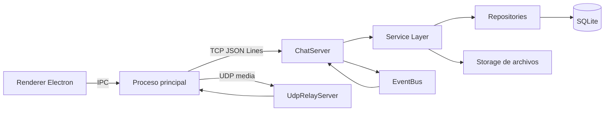
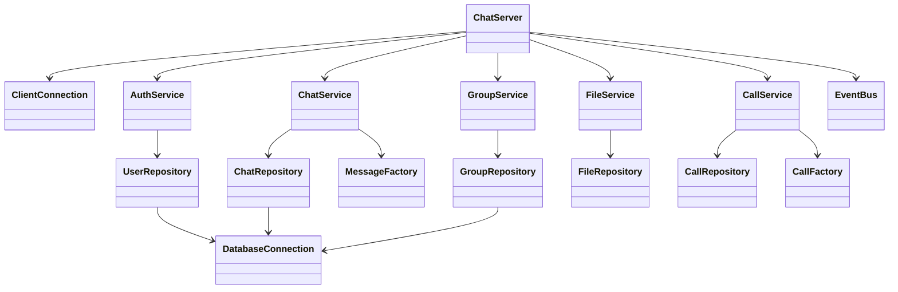
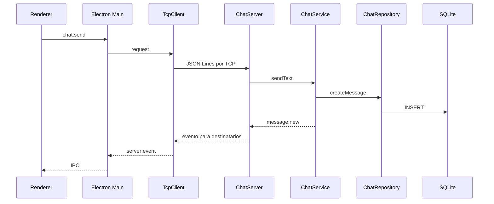
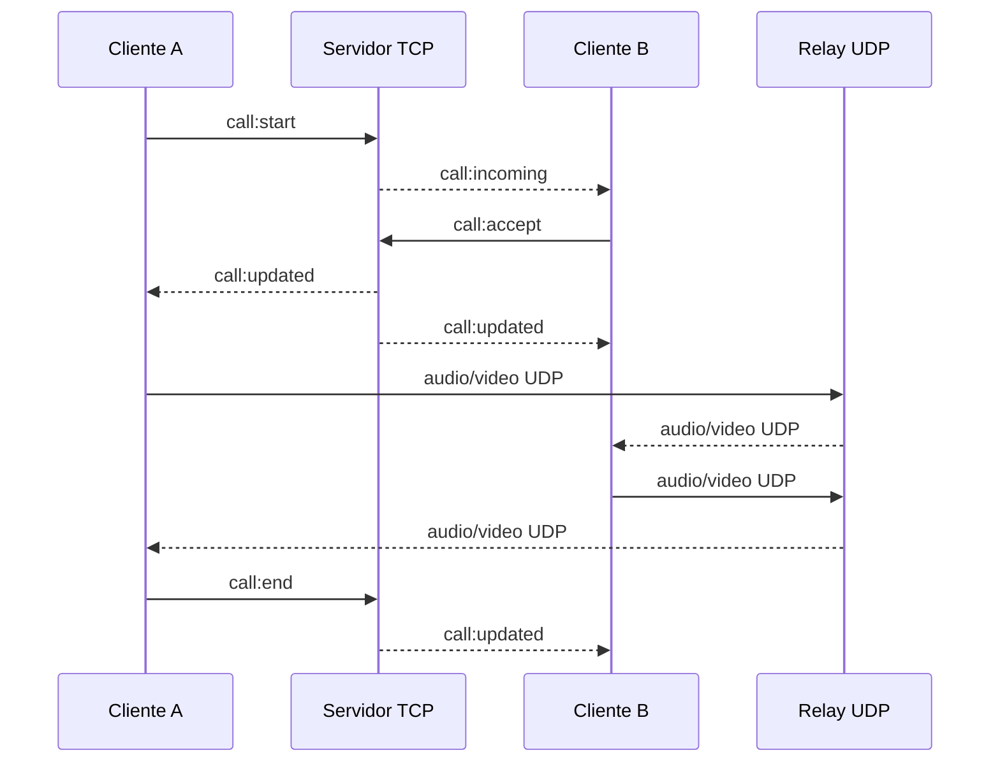

# Arquitectura y patrones de Chad

## Componentes

## Capas

### Presentación

`src/renderer`

Renderiza autenticación, chats, grupos, llamadas y ajustes. No tiene acceso a
Node, sockets o SQLite.

### Puente Electron

`src/main`

Expone una API limitada mediante `contextBridge`. Gestiona diálogos de archivos,
TCP y UDP.

### Red

`src/backend/network` y `src/backend/server`

Implementa el framing JSON Lines, solicitudes/respuestas, eventos, sesiones TCP
y retransmisión UDP.

### Negocio

`src/backend/services`

Contiene autenticación, reglas de conversaciones, permisos de grupos,
transferencias, llamadas y ajustes.

### Datos

`src/backend/repositories` y `src/backend/database`

Los repositorios son la única capa que ejecuta SQL.

## Diagrama de clases resumido

## Patrones

### Singleton

Una única instancia de:

- `DatabaseConnection`
- `AppConfig`
- `EventBus`

### Factory Method

`MessageFactory.create` selecciona `Message` o `FileMessage`.

`CallFactory.create` selecciona `AudioCall` o `VideoCall`.

### Observer

Los servicios publican eventos en `EventBus`. `ChatServer` observa esos eventos
y notifica las sesiones conectadas. El renderer observa los eventos del proceso
principal.

### Repository

Cada repositorio encapsula SQL de una entidad o agregado. Los servicios no
conocen detalles de tablas.

### Service Layer

Los servicios contienen casos de uso y permisos. Por ejemplo, `ChatService`
verifica pertenencia antes de crear un mensaje.

## Secuencia de mensaje

## Secuencia de llamada

